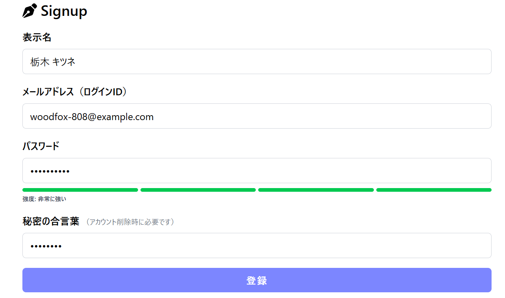
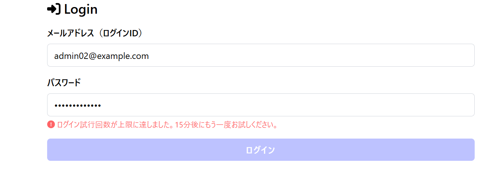
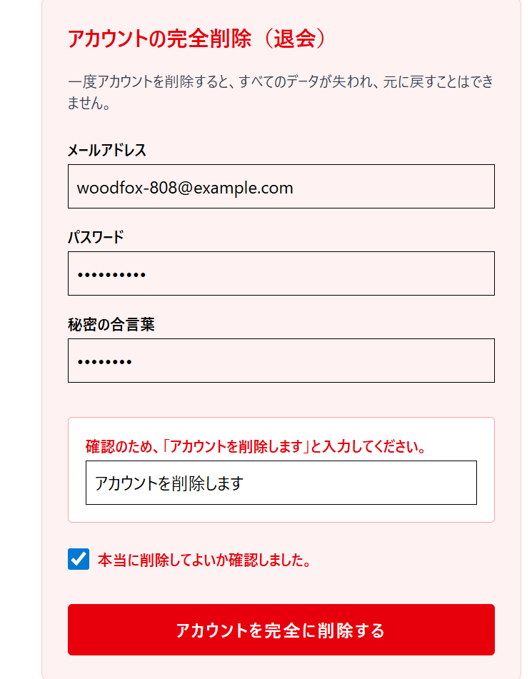
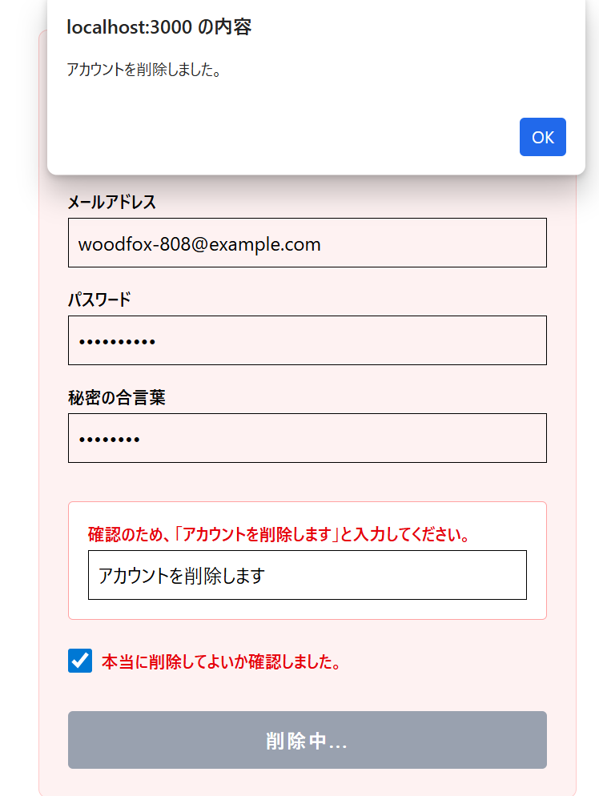

# Secure_Webapp

## 概要
　実習課題としてウェブアプリに認証・認可機能を追加しました。

　追加した主な機能は以下の3点です。  
    ・連続N回のログイン失敗でアカウントロックする機能  
    ・サインアップのときにパスワード強度を表示するような機能  
    ・サインアップ時に秘密の合言葉を設定し、それを用いてアカウントを削除する機能  

## 主な実装機能 (Key Features)

### 1. リアルタイム・パスワード強度表示 (Signup)
ユーザーがサインアップ時に推測されにくいパスワードを設定できるよう、視覚的なフィードバックを提供します。
* **特徴:** `react-hook-form` と `Zod` を連携し、入力値をリアルタイムで監視。
* **判定基準:** 文字数（8文字以上）、大文字・小文字の混在、数字、記号の有無で0〜4段階のスコアを算出。
* **UI表示:** スコアに応じてプログレスバーの色が「赤 → 橙 → 黄 → 緑」と変化し、強度ラベル（「非常に弱い」〜「非常に強い」）を表示。
 

 

主な変更点  
app/_types/CommonSchems.ts 33行～44行  
if文を用いた条件ごとに加算式でのスコア評価 ラベルなどの設定  
app/signup/page.tsx 146行～163行  
前述した評価を基にしたラベルの適用  

### 2. IPアドレスベースのログイン試行制限・アカウントロック (Login)
パスワードスプレー攻撃やクレデンシャルスタッフィング（リスト型攻撃）を防ぐためのレートリミット機能です。
* **特徴:** 連続してログインに失敗した場合、対象のIPアドレスからのアクセスを一定時間ブロックします。
* **ルール:** 1つのIPアドレスから **5回連続** でログインに失敗した場合、**15分間** アカウントをロック（ログイン試行を拒否）。
* **実装:** データベースに `LoginAttempt` テーブルを追加し、`x-forwarded-for` ヘッダーから取得したIPアドレスごとに失敗回数と最終試行日時を記録。成功時にリセット。
 

 

主な変更点  
prisma/schema.prisma 65行～69行  
テーブルの追加 IPアドレスと回数と日時  
app/api/login/route.ts 22行～51行 75行～80行 98行～103行  
IPアドレスの取得 ロックの設定 回数の確認  

### 3. 秘密の合言葉によるアカウント保護 (Signup & Delete)
アカウントの不正削除を防ぐため、サインアップ時に「秘密の合言葉 (Secret Phrase)」を登録する仕組みを導入しました。
* **特徴:** パスワードとは別に、退会時専用の認証情報として機能します。
* **セキュリティ:** データベースには平文で保存せず、パスワードと同様に `bcryptjs` を用いてハッシュ化して保存。

#### フールプルーフを備えたアカウント完全削除 (Delete Account)
ユーザーの意図しない誤操作（誤タップなど）によるアカウント消失を防ぐ、フェイルセーフな退会UIです。
* **要求される認証情報:** 「メールアドレス」「パスワード」「秘密の合言葉」の3点の一致。
* **タイピング確認:** 確認として「アカウントを削除します」という指定文字列の正確な入力を強制（Zodの `literal` バリデーションを利用）。
* **最終確認:** 同意チェックボックス（`isConfirmed`）をチェックしないと送信不可。
* **ボタン制御:** 全ての条件を満たすまで、削除ボタンは非活性（disabled）状態を維持。
 

 
  

主な変更点  
prisma/schema.prisma 34行  
secretPhrase レコードの追加  
prisma/seed.ts 82行目など  
secretPhraseをuserseedに追加  
app/_types/DeleteRequest.ts 完全新規  
アカウントを削除するための.tsファイル  
app/_types/UserSeed.ts 16行目など  
secretPhraseSchemaの適用  
app/_actions/signup.ts 43行目など  
合言葉に対してのハッシュの適用  
app/singup/page.tsx 169行～185行  
合言葉登録用のフォームの追加  
app/api/delete/route.ts 完全新規  
パスワード・合言葉の検証 削除実行  
app/delete/page.tsx 完全新規  
削除実行用のページの追加  
